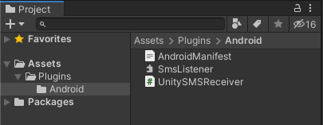
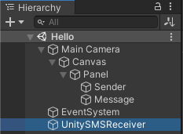
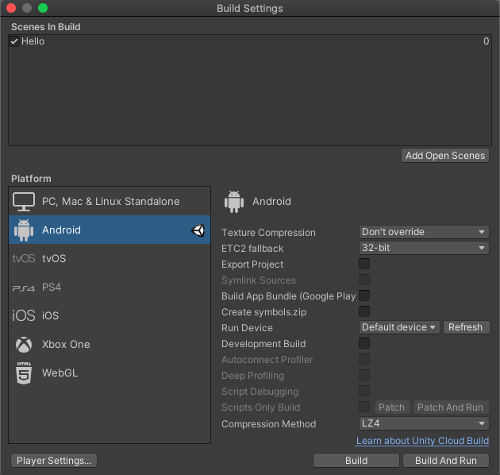

A simple demo for receive SMS with Android plugin in Unity


# Environment
Unity 2019.4.12f1

Android Studio 4.0.1

# Test Devices

Android Emulator

CPU/ABI: Google Play Intel Atom (x86)

Target: google_apis_playstore [Google Play] (API level 30)

# How it works
## Android plugin

1. `SmsListener.java` is the main componment to receive SMS message and pass the result to unity side.
1. Customizing the `Android manifest`:
    
    Permission to receive and read SMS:
    ```
    <uses-permission android:name="android.permission.RECEIVE_SMS" />
    <uses-permission android:name="android.permission.READ_SMS" />
    ```

    Specify the broadcast receiver:
    ```
    <receiver android:name="com.ming.hello.SmsListener" android:enabled="true">
      <intent-filter>
        <action android:name="android.provider.Telephony.SMS_RECEIVED" />
      </intent-filter>
    </receiver>
    ```
## Unity


1. Place a gameobgect named `UnitySMSReceiver` to receive message from android plugin side.
1. Attach a script to the gameobject and declare a method to receive message send from Android plugin
    ```
    public void OnSMSReceive (string message)
    ```
1. From android side, invoke this method through UnityPlayer API
    ```
    UnityPlayer.UnitySendMessage(gameobject_name, method_name, message);
    ```

## References:
* [Using Java or Kotlin source files as plug-ins](https://docs.unity3d.com/Manual/AndroidJavaSourcePlugins.html)
* [Android Manifest](https://docs.unity3d.com/Manual/android-manifest.html)
* [receiver](https://developer.android.com/guide/topics/manifest/receiver-element)
* [JAR plug-ins](https://docs.unity3d.com/Manual/AndroidJARPlugins.html)

# How to build
1. Clone this repository
1. Use Unity to open `UnityReceieveSMSDemo` directory
1. Switch to Android platform
1. Build or export to create apk and run



# Troubleshooting
* Android app permission:
    This demo project has not handle the SMS permission yet.
    If you can't receive any message, check app permission first.
* How to grant SMS permission?


